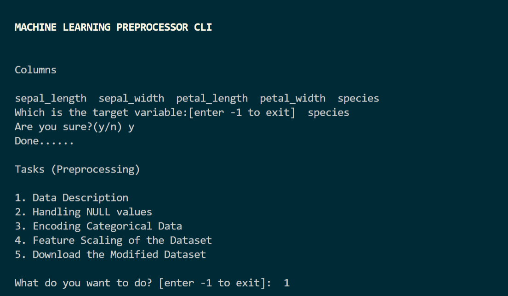

# Machine Learning Preprocessor CLI

Preprocess the dataset and save time.

## Gist

- This CLI provides various options to preprocess the data. 
- Options:
    - Data Description
    - Handling NULL Values
    - Encoding Categorical Data
    - Feature Scaling
- We can also **DOWNLOAD** the modified dataset.

## Usage

- Clone this Repository: `git clone https://github.com/tanmayChakrawarty/ML-Preprocessor-CLI.git`
- `cd ML-Preprocessor-CLI`
- `pip install pandas`
- `pip install scikit-learn`
- Now run, `python main.py dataset.csv`
- Final result below

 

## Contributing
Pull requests are welcome. For major changes, please open an issue first to discuss what you would like to change.

Please make sure to update tests as appropriate.